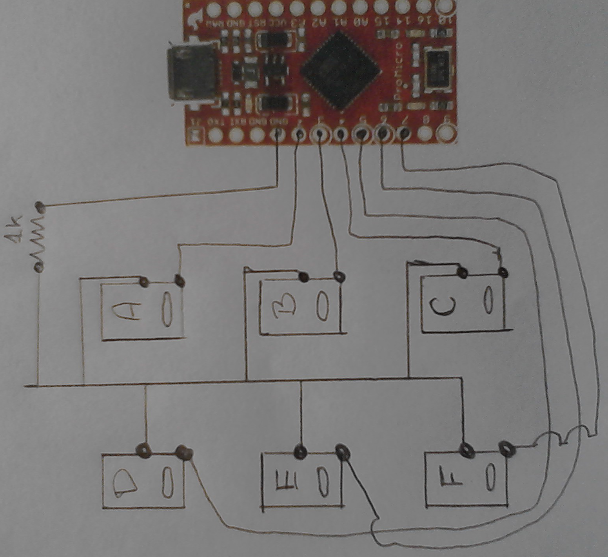

<?xml version="1.0" encoding="utf-8"?>
<!DOCTYPE html PUBLIC "-//W3C//DTD XHTML 1.0 Strict//EN"
               "http://www.w3.org/TR/xhtml1/DTD/xhtml1-strict.dtd">
<html xmlns="http://www.w3.org/1999/xhtml" lang="en" xml:lang="en">
<head>
<title>MakeGkosEn</title>
<meta http-equiv="Content-Type" content="text/html;charset=utf-8"/>
<meta name="title" content="MakeGkosEn"/>
<meta name="generator" content="Org-mode"/>
<meta name="generated" content="2014-07-25 01:11:49 UTC"/>
<meta name="author" content=""/>
<meta name="description" content=""/>
<meta name="keywords" content=""/>

</head>
<body>

<h1 class="title">MakeGkosEn</h1>

<h2>Table of Contents</h2>

<ul>
<li><a href="#sec-1">1 USB keyboard GKOS</a>
<ul>
<li><a href="#sec-1-1">1.1 Materials</a></li>
<li><a href="#sec-1-2">1.2 Software</a></li>
<li><a href="#sec-1-3">1.3 Procedure</a>
<ul>
<li><a href="#sec-1-3-1">1.3.1 Hardware</a></li>
<li><a href="#sec-1-3-2">1.3.2 Software</a></li>
</ul>
</li>
</ul>
</li>
</ul>

<h2 id="sec-1">1 USB keyboard GKOS</h2>

<h3 id="sec-1-1">1.1 Materials</h3>

<ul>
<li>1 - Arduino pro micro <a href="https://www.sparkfun.com/products/12640">https://www.sparkfun.com/products/12640</a>

</li>
<li>1 - 1K resistor 

</li>
<li>6 - Mouse Buttons (test them well if mouse are old) 

</li>
<li>1 - Breadboard welding 

</li>
<li>Other materials to build the "body" of the keyboard. 
</li>
</ul>

<h3 id="sec-1-2">1.2 Software</h3>

From this site we get the main software for the keyboard: <a href="http://gkos.com/gkos/arduino/index.html">http://gkos.com/gkos/arduino/index.html</a>
We repeat here the links. 

<ul>
<li>Java to run the Arduino IDE I use jre1.6.0. 
</li>
<li>GKOS library v.1.5 (2010-04-14) for Arduino IDE <a href="http://gkos.com/gkos/arduino/library/Gkos_library_2010-04-14.zip">http://gkos.com/gkos/arduino/library/Gkos_library_2010-04-14.zip</a> 
</li>
<li>Arduino Arduino IDE 1.0.5 <a href="http://arduino.cc/en/Main/Software # TOC2">http://arduino.cc/en/Main/Software # TOC2</a> 
</li>
<li>Also the software for pro micro  was obtained <a href="https://github.com/sparkfun/SF32u4_boards">https://github.com/sparkfun/SF32u4_boards</a>
</li>
</ul>

<h3 id="sec-1-3">1.3 Procedure</h3>

<h4 id="sec-1-3-1">1.3.1 Hardware</h4>

 

<h4 id="sec-1-3-2">1.3.2 Software</h4>

I did all this in Linux, but should work for other operating systems. 

<ul>
<li id="sec-1-3-2-1">Installing Arduino IDE 
This leads us "arduino-1.0.5" directory with the files needed to use the Arduino IDE. 
</li>
</ul>
<ul>
<li id="sec-1-3-2-2">Unzip the library GKOS 
Just unzip in "arduino-1.0.5/libraries" and get something like this: 

<pre class="example">ls -l arduino-1.0.5/libraries/
total 20
drwxr-xr-x 3 guest guest   72 May 17  2013 EEPROM/
drwxr-xr-x 3 guest guest   74 May 17  2013 Esplora/
drwxr-xr-x 4 guest guest 4096 May 17  2013 Ethernet/
drwxr-xr-x 3 guest guest  122 May 17  2013 Firmata/
drwxr-xr-x 3 guest guest 4096 May 17  2013 GSM/
drwxr-xr-x 3 guest guest  152 Jul 21 00:23 Gkos/
drwxr-xr-x 3 guest guest   86 May 17  2013 LiquidCrystal/
......
</pre>

</li>
</ul>
<ul>
<li id="sec-1-3-2-3">Run arduino IDE. 
It is a Java program in "arduino-1.0.5/arduino" 
This opens up for the first time the Arduino IDE. 
If we look at the examples available we will meet the GKOS installed before. 
If I tried it now it will not run, a few steps missing. 
Open and recorded some test sketch, this creates us in our working directory "sketchbook" 

<pre class="example">ls -l sketchbook/
total 0
drwxr-xr-x 2 root  root  30 Jul 12 03:46 gkos_usb_keyb/
drwxr-xr-x 3 guest guest 33 Jul 13 01:43 hardware/
drwxr-xr-x 2 guest guest 23 Jul 12 03:04 libraries/
</pre>

</li>
</ul>
<ul>
<li id="sec-1-3-2-4">The software pro micro. 
Under the hardware directory unzip the software for pro micro "sketchbook/hardware/SF32u4_boards-master" 
The next time we run the Arduino IDE we have available this model in the hardware list. 

</li>
</ul>
<ul>
<li id="sec-1-3-2-5">Files modified 
"arduino-1.0.5/libraries/Gkos/Gkos.cpp" This is the modified file <a href="./Gkos.cpp">./Gkos.cpp</a> 
And the script arduino a modification of "arduino-1.0.5/libraries/Gkos/examples/gkos_serial01/gkos_serial01.pde"
became this: <a href="./gkos_usb_keyb.ino">./gkos_usb_keyb.ino</a> 
That is the one we open with the Arduino IDE to compile and install the software.

Thats all folks.

</li>
</ul>

Date: 2014-07-25 01:11:49 UTC

Author: 

Org version 7.8.11 with Emacs version 24

<a href="http://validator.w3.org/check?uri=referer">Validate XHTML 1.0</a>

</body>
</html>
